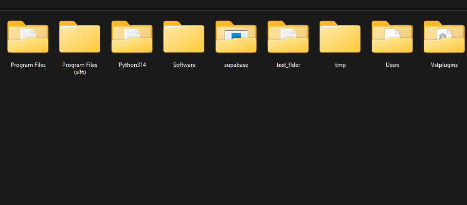
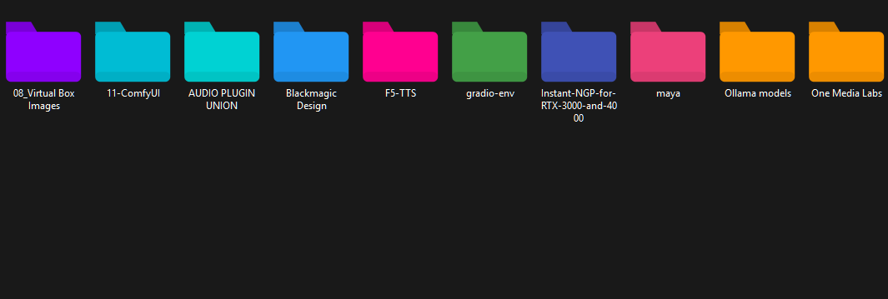

# FeColorizer

**Automatic folder colorization for Windows 11 File Explorer**

FeColorizer is a lightweight Windows utility that automatically applies color-coded icons to your folders based on their first letter. Transform your file system into an organized, visually intuitive workspace with zero ongoing effort.

---

## Before Colorizer:



## After Colorizer: 



## Features

- **Automatic Color Mapping**: Each folder gets a unique color based on its first letter (A=Aqua, B=Blue, C=Cyan, etc.)
- **Context Menu Integration**: Right-click any folder or drive to colorize or revert subfolders
- **Drive Support**: Works on drive roots (D:\, E:\, etc.) as well as regular directories
- **Zero UI**: Completely silent operation with no windows, tray icons, or background services
- **Instant Results**: See changes immediately in File Explorer, including in Large icon view
- **Reversible**: Remove colors at any time with a single right-click
- **Installer-based**: Standard Windows installer with clean uninstall via Settings → Apps
- **Native Windows Integration**: Uses Windows' built-in desktop.ini system for maximum compatibility

---

## Installation

1. **Download** `FeColorizer-Setup.exe`
2. **Double-click** the installer
3. Click **Yes** at the UAC prompt
4. Done — context menu entries are registered and all 26 color icons are pre-generated

**System Requirements**:
- Windows 10 or Windows 11
- Administrator privileges for installation
- x64 architecture

---

## Usage

### Colorize Folders
1. Navigate to any folder in File Explorer (or open **This PC** for drives)
2. Right-click the parent folder or drive root
3. Select **Colorize subfolders**
4. All immediate subfolders are automatically color-coded

### Remove Colors
1. Right-click the parent folder or drive root
2. Select **Remove folder colors**
3. All custom colors are removed, restoring default icons

---

## Color Map

| Letter | Color      | Letter | Color      | Letter | Color     |
|--------|------------|--------|------------|--------|-----------|
| A      | Aqua       | J      | Jade       | S      | Silver    |
| B      | Blue       | K      | Khaki      | T      | Turquoise |
| C      | Cyan       | L      | Lavender   | U      | Umber     |
| D      | Denim      | M      | Magenta    | V      | Violet    |
| E      | Emerald    | N      | Navy       | W      | White     |
| F      | Fuchsia    | O      | Orange     | X      | Xanadu    |
| G      | Green      | P      | Purple     | Y      | Yellow    |
| H      | Hazel      | Q      | Quartz     | Z      | Zinc      |
| I      | Indigo     | R      | Red        |        |           |

Folders with numeric or symbol prefixes (e.g. `01-Downloads`) use the first letter found — so `01-Downloads` → D → Denim.

---

## Technical Details

### How It Works
FeColorizer uses Windows' native `desktop.ini` mechanism to set custom icons. For each subfolder:
1. Retrieves the pre-generated colored `.ico` file for the folder's first letter
2. Writes a `desktop.ini` inside the folder referencing the icon path
3. Sets the required `Hidden|System` attribute on `desktop.ini` and `ReadOnly` on the folder
4. Synchronously updates the Windows thumbnail cache via `IThumbnailCache::GetThumbnail(WTS_FORCEEXTRACTION)` to prevent stale entries in Large icon view
5. Sends shell change notifications so File Explorer refreshes immediately

Icons are stored in `%AppData%\FeColorizer\icons\` and generated once at install time.

### Architecture
- **Language**: C# .NET 8
- **Output**: Single-file self-contained executable
- **Icon Generation**: System.Drawing with anti-aliased folder shapes (256, 48, 32, 16 px)
- **Registry Integration**: `HKCR\Directory\shell` and `HKCR\Drive\shell` entries
- **Installer**: Inno Setup — registers context menus, pre-generates icons, cleans up on uninstall

### Safety
- Only modifies folders you explicitly select via context menu
- Skips folders already colorized by FeColorizer (idempotent)
- Handles permission errors gracefully — inaccessible folders are silently skipped
- All changes are reversible
- Does not run in the background or monitor the file system

---

## Resetting the Thumbnail Cache

If colors appear inconsistently after colorizing (e.g. some views show them, others don't), clear the Windows thumbnail cache:

1. Open `C:\Program Files\FeColorizer\`
2. Run **ResetThumbnailCache.bat**
3. Accept the UAC prompt — Explorer will restart with a clean cache

Then re-apply colors via the context menu.

---

## Uninstallation

1. Open **Windows Settings → Apps**
2. Search for **FeColorizer** and click **Uninstall**

The uninstaller removes the context menu entries and the `%AppData%\FeColorizer\` icon cache. Colorized folders retain their colors until you revert them via right-click.

---

## FAQ

**Q: Will this slow down my system?**
A: No. FeColorizer only runs when invoked via right-click. There is no background service.

**Q: Can I colorize a drive root like D:\\?**
A: Yes. Right-click any drive in **This PC** and select **Colorize subfolders**.

**Q: Why do some folders not change color?**
A: Folders that start with a digit or symbol and contain no letters are skipped. Folders already colorized by FeColorizer are also skipped (idempotent — run it again safely without duplicating work).

**Q: Colors show in List view but not Large icon view?**
A: This is a Windows thumbnail cache issue. Run **ResetThumbnailCache.bat** from the install folder, then re-apply colors.

**Q: Can I customize the color mappings?**
A: Not in the current version.

**Q: Does this work with cloud storage folders?**
A: Yes, but OneDrive/Dropbox may sync the `desktop.ini` files to other devices where FeColorizer isn't installed, causing broken icon references on those machines.

---

## Building from Source

```bash
git clone https://github.com/lucidiancreative/FEcolorizer.git
cd FEcolorizer
dotnet publish -c Release -r win-x64 --self-contained true -p:PublishSingleFile=true -p:DebugType=none -p:DebugSymbols=false
```

Then compile `installer/FeColorizer.iss` with Inno Setup to produce `FeColorizer-Setup.exe`.

---

## License

MIT License — see LICENSE file for details.

---

## Changelog

### v1.0.0 (2026-03-01)
- Initial release
- 26-color letter-based folder colorization
- Context menu integration for folders and drive roots
- Thumbnail cache synchronization for consistent Large icon view display
- Installer-based deployment (Inno Setup)
- ResetThumbnailCache utility included
